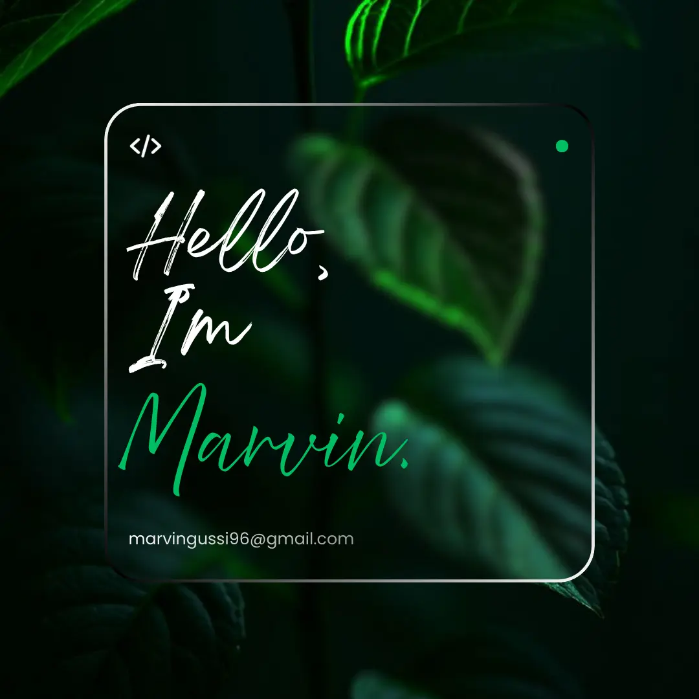

<!-- 

  

 -->

I believe every developer is also a lifelong learner. For me, books are a way to explore new ideas, while code is a way to turn those ideas into reality. I enjoy solving problems, learning new technologies, and building things that challenge me to grow. 

--- 

<h3>Currently working with:</h3>

    

<h3 align="center">Languages</h3>

  

<h3 align="center">Frontend</h3>

  

<h3 align="center">Backend</h3>

  

<h3 align="center">Databases</h3>

  

<h3 align="center">Tools & DevOps</h3>

  

<h2 align="center" style="margin: 5px 10px;">Github stats:</h2> 

<a href="https://next.ossinsight.io/widgets/official/analyze-user-contribution-time-distribution?period=all_times&user_id=82397487" target="_blank" style="display: block" align="center">
  <picture>
    <source media="(prefers-color-scheme: dark)" srcset="https://next.ossinsight.io/widgets/official/analyze-user-contribution-time-distribution/thumbnail.png?period=all_times&user_id=82397487&image_size=auto&color_scheme=dark" width="721" height="auto">
    
  </picture>
</a>

<!-- Made with [OSS Insight](https://ossinsight.io/) -->